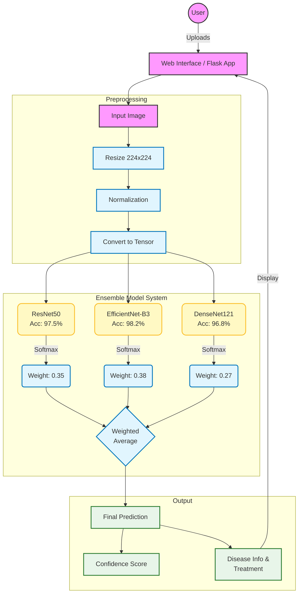
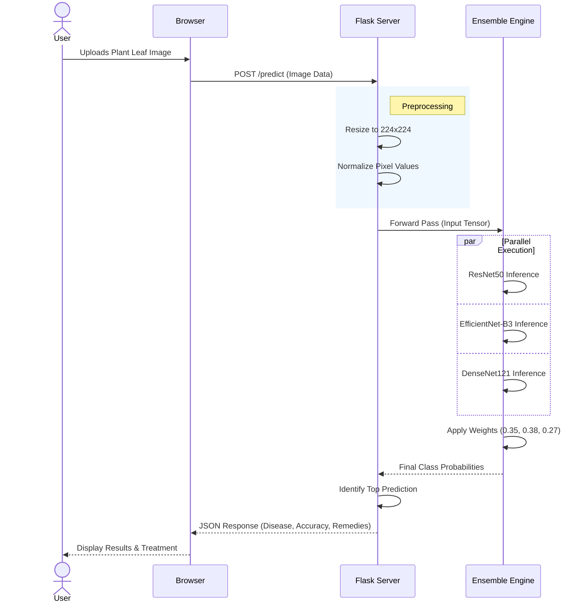

# System Architecture

## Plant Disease Detection System

The system uses a multi-model ensemble approach to achieve high accuracy in plant disease detection. It combines three state-of-the-art deep learning models: ResNet50, EfficientNet-B3, and DenseNet121.

### 1. Detailed System Flowchart

### 2. Execution Sequence Diagram

### 3. Vision Transformer (ViT) Pipeline

The system now also supports a **Vision Transformer (ViT)** model — the state-of-the-art architecture for image classification tasks.

#### How ViT Works:
1. **Patch Embedding**: The input image (224×224) is split into 16×16 patches (196 patches total)
2. **Positional Encoding**: Each patch is embedded and given a positional encoding
3. **Transformer Encoder**: 12 layers of multi-head self-attention + FFN process the patches
4. **Classification Head**: The [CLS] token output is passed through a custom head for 39-class prediction

#### Key ViT Features:
- **Pretrained backbone**: ViT-Base-Patch16-224 pretrained on ImageNet-21K
- **Progressive unfreezing**: Head → last 2 blocks → full model
- **Label smoothing**: 0.1 for better generalization
- **Cosine warmup LR schedule**: Prevents early overfitting
- **Mixed precision training**: FP16 for 2× faster training on GPU

### 4. Key Components

| Component | Technology | Role |
|-----------|------------|------|
| **Frontend** | HTML5, CSS3, JS | User interface for image upload and result visualization |
| **Backend** | Python, Flask | API server, routing, and business logic |
| **Preprocessing** | OpenCV/PIL, NumPy | Image resizing, normalization, and tensor conversion |
| **Model 1** | Custom CNN (PyTorch) | Basic convolutional network baseline |
| **Model 2** | ResNet50 (PyTorch) | Deep residual learning with transfer learning |
| **Model 3** | **Vision Transformer (ViT)** | **State-of-the-art transformer-based image classification** |
| **Model 4** | EfficientNet-B3 | Optimized for efficiency and accuracy balance |
| **Model 5** | DenseNet121 | Feature reuse via dense connections |
| **Ensemble** | Custom Logic | Weighted averaging of model outputs |
| **ViT Library** | timm / HuggingFace transformers | Pretrained ViT models and utilities |
